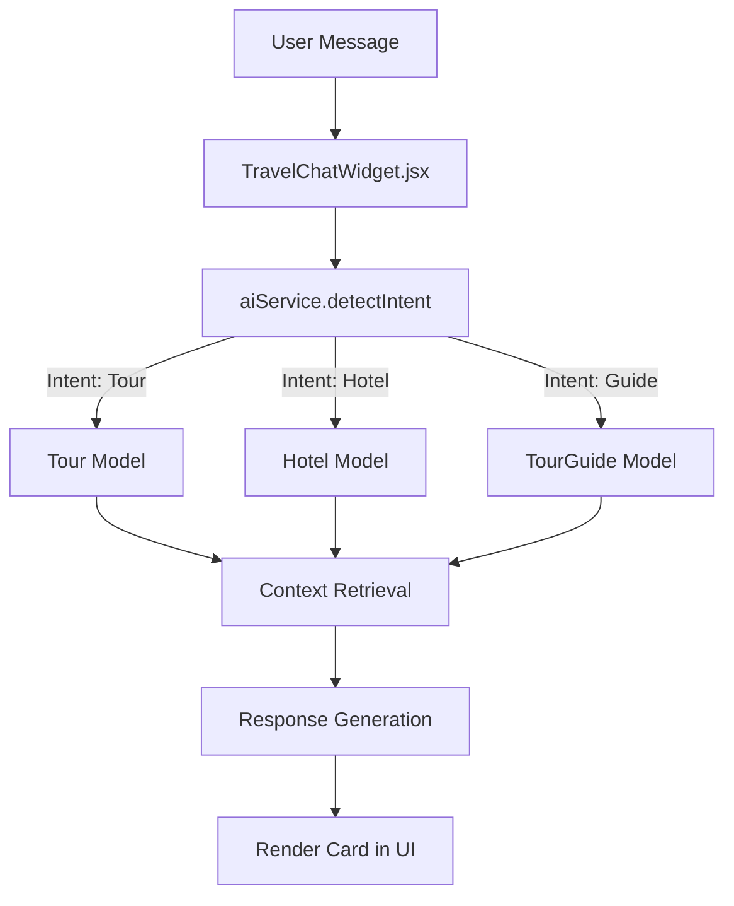

# Chatbot Architecture Documentation

## Overview
The **PearlPath AI Chatbot** provides travel‑related assistance through a multi‑phase architecture. It currently supports two stable phases:

1. **Intent Detection & Context Retrieval** – Users can ask about tours, hotels, guides, or general travel information. The backend determines the intent and pulls relevant data from MongoDB.
2. **Rich Card Rendering** – The frontend displays responses as styled cards with images, titles, and action buttons.

Phase 3 (interactive booking overlay) is still experimental and has been excluded from the `main` branch as per the current roadmap.

---

## High‑Level Flow


* **Frontend (`TravelChatWidget.jsx`)** – Captures user input (text, STT) and displays bot responses.
* **Backend Service (`aiService.js`)** –
  - Detects intent via LLM (OpenAI/Gemini) when API keys are present, otherwise falls back to regex‑based mock detection.
  - Retrieves the appropriate MongoDB collection based on the intent.
  - Generates a textual response using the selected LLM or a deterministic mock.
* **Controller (`chatController.js`)** – Exposes `/api/chat` endpoint, delegates to `aiService`.
* **Routers (`adminRouter.js`, `server.js`)** – Wire the controller into the Express app.

---

## Key Files
| Component | Path | Responsibility |
|-----------|------|----------------|
| **Frontend UI** | `frontend/src/components/TravelChatWidget.jsx` | Captures input, renders cards, handles STT/TTS. |
| **App Entry** | `frontend/src/App.jsx` | Mounts the widget and provides auth context. |
| **Chat Controller** | `backend/controllers/chatController.js` | HTTP layer for chat requests. |
| **AI Service** | `backend/services/aiService.js` | Intent detection, context lookup, response generation. |
| **Routers** | `backend/routers/*.js` | Connect controllers to Express. |
| **Models** | `backend/models/*.js` | Mongoose schemas for Tour, Hotel, Guide, Booking. |

---

## Environment Variables
| Variable | Description |
|----------|-------------|
| `MONGODB_URI` | MongoDB connection string. |
| `OPENAI_API_KEY` | (Optional) Enables OpenAI LLM fallback. |
| `GEMINI_API_KEY` | (Optional) Enables Gemini LLM fallback. |
| `PORT` | Port for the Express server (default `5000`). |

---

## Running Locally
```bash
# Clone the repo
git clone https://github.com/cepdnaclk/e22-co2060-PearlPath.git
cd e22-co2060-PearlPath

# Install dependencies
npm install               # root (for scripts)
cd backend && npm install
cd ../frontend && npm install

# Set up environment (copy .env.example)
cp backend/.env.example backend/.env
# Edit .env with your MongoDB URI and optional LLM keys.

# Start the server
npm run dev   # runs backend and frontend concurrently
```
The chatbot will be available at `http://localhost:3000`.

---

## Testing
A minimal test suite lives under `backend/tests/`. Run:
```bash
cd backend
npm test
```
Add more unit tests for `aiService` to demonstrate contribution.

---

## Contributing
See the companion **CONTRIBUTING.md** for guidelines on how to add documentation, write tests, or propose new features without merging experimental code.

---

*Document version:* 2026‑07‑22
